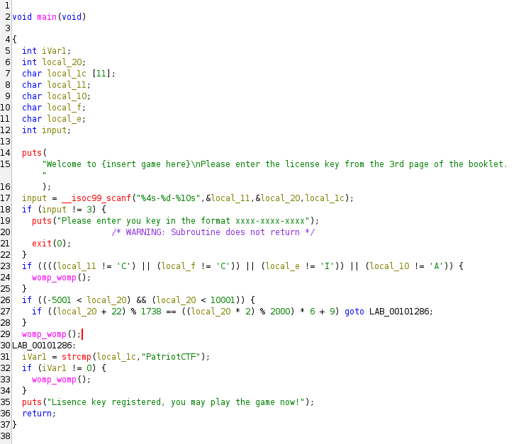
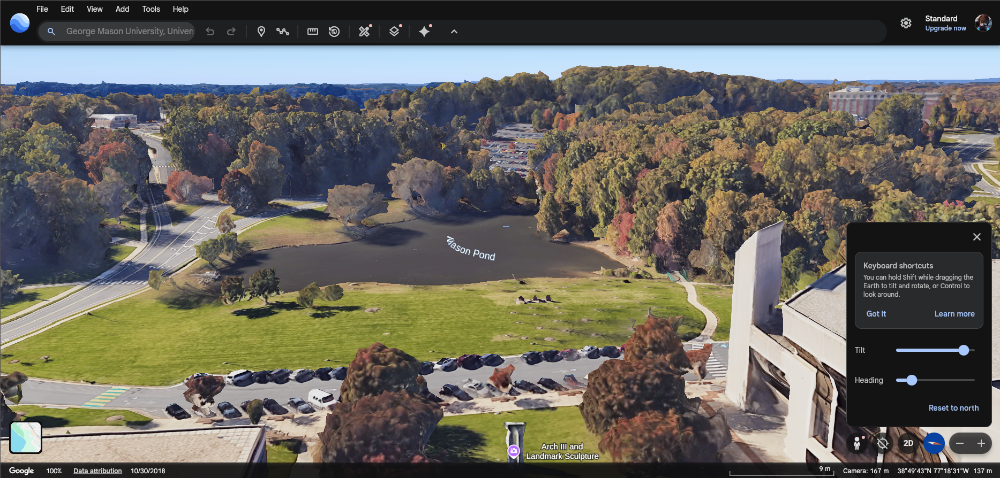
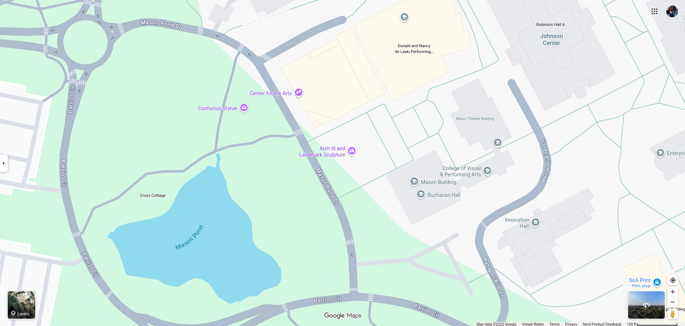

### Space Pirates 2
This was a reversing challenge, and based on the given code, written in Rust, I knew I had to invert the encryption pipeline: step 6 -> step 5 -> ... -> step 1 to get the flag. The Rust code was as followed:

```
/*
 * SPACE PIRATES CTF CHALLENGE - LEVEL 2: THE TREASURE MAP
 * ========================================================
 * You decoded the coordinates and found the pirates' 
 * hidden base. Now you've discovered their treasure map, but it's encrypted 
 * with an even MORE complex cipher. The pirates learned from their mistake 
 * and upgraded their security!
 * 
 */

use std::env;
use std::process;

// The target encrypted treasure map (what we want the transformed input to become)
const TARGET: [u8; 32] = [
    0x15, 0x5A, 0xAC, 0xF6, 0x36, 0x22, 0x3B, 0x52, 0x6C, 0x4F, 0x90, 0xD9, 0x35, 0x63, 0xF8, 0x0E, 0x02, 0x33, 0xB0, 0xF1, 0xB7, 0x69, 0x42, 0x67, 0x25, 0xEA, 0x96, 0x63, 0x1B, 0xA7, 0x03, 0x0B
];

// The pirate's NEW rotating XOR key (upgraded security!)
const XOR_KEY: [u8; 5] = [0x7E, 0x33, 0x91, 0x4C, 0xA5];

// NEW: Rotation amounts for each position modulo 7
const ROTATION_PATTERN: [u32; 7] = [1, 3, 5, 7, 2, 4, 6];

// The magic subtraction constant (they switched from addition!)
const MAGIC_SUB: u8 = 0x5D;

//input: &str
fn print_flag(buffer: &str) {
    println!("\n╔══════════════════════════════════════════╗");
    println!("║                                          ║");
    println!("║     _______________                      ║");
    println!("║    /               \\                     ║");
    println!("║   /  💎  💰  💎  💰  \\                    ║");
    println!("║  |   💰  💎  💰  💎   |                   ║");
    println!("║  |  💎 TREASURE! 💎  |                   ║");
    println!("║  |   💰  💎  💰  💎   |                   ║");
    println!("║   \\  💎  💰  💎  💰  /                    ║");
    println!("║    \\_______________ /                    ║");
    println!("║         |     |                          ║");
    println!("║         |_____|                          ║");
    println!("║                                          ║");
    println!("╚══════════════════════════════════════════╝");
    println!("\n🏴‍☠️  LEVEL 2 COMPLETE! YOU FOUND THE TREASURE! 🏴‍☠️\n");
    println!("The pirates' secret hoard is yours!\n");
    println!("Flag: {0}\n", buffer);
    println!("You've mastered the advanced pirate cipher!");
    println!("The treasure contains riches beyond imagination!\n");
}

/// Rotate a byte left by n positions
/// This is a bijection because all 8 bit rotations of a byte are unique
/// ROL(ROL(x, n), 8-n) = x, proving invertibility
fn rotate_left(byte: u8, n: u32) -> u8 {
    byte.rotate_left(n % 8)
}

/// OPERATION 1: XOR with NEW rotating key
/// Each byte is XORed with one of 5 NEW key bytes (cycling through them)
/// Bijection proof: (x ⊕ k) ⊕ k = x (XOR involution)
fn apply_quantum_cipher_v2(buffer: &mut [u8]) {
    for (i, byte) in buffer.iter_mut().enumerate() {
        *byte ^= XOR_KEY[i % 5];
    }
}

/// OPERATION 2 (NEW!): Rotate Left with varying amounts
/// Each byte is rotated left by an amount determined by its position
/// Bijection proof: ROL⁻¹ = ROR with same amount
/// The rotation amount varies: position mod 7 selects from ROTATION_PATTERN
fn apply_stellar_rotation(buffer: &mut [u8]) {
    for (i, byte) in buffer.iter_mut().enumerate() {
        let rotation = ROTATION_PATTERN[i % 7];
        *byte = rotate_left(*byte, rotation);
    }
}

/// OPERATION 3: Swap adjacent byte pairs
/// Bytes at positions (0,1), (2,3), (4,5), etc. are swapped
/// Bijection proof: Swapping twice returns original (f ∘ f = identity)
fn apply_spatial_transposition(buffer: &mut [u8]) {
    for i in (0..buffer.len()).step_by(2) {
        buffer.swap(i, i + 1);
    }
}

/// OPERATION 4: Subtract magic constant (mod 256) - CHANGED FROM ADDITION!
/// Each byte has MAGIC_SUB subtracted from it (wrapping at 256)
/// Bijection proof: (x - k) + k ≡ x (mod 256)
/// Subtraction forms a group, every element has unique inverse
fn apply_gravitational_shift_v2(buffer: &mut [u8]) {
    for byte in buffer.iter_mut() {
        *byte = byte.wrapping_sub(MAGIC_SUB);
    }
}

/// OPERATION 5 (NEW!): Reverse bytes in chunks of 5
/// Splits the 30-byte buffer into 6 chunks of 5, reverses each chunk
/// Chunk 0: [0,1,2,3,4] -> [4,3,2,1,0]
/// Chunk 1: [5,6,7,8,9] -> [9,8,7,6,5], etc.
/// Bijection proof: Reversal is self-inverse, f(f(x)) = x
fn apply_temporal_inversion(buffer: &mut [u8]) {
    const CHUNK_SIZE: usize = 5;
    for chunk_start in (0..buffer.len()).step_by(CHUNK_SIZE) {
        let chunk_end = (chunk_start + CHUNK_SIZE).min(buffer.len());
        buffer[chunk_start..chunk_end].reverse();
    }
}

/// OPERATION 6 (NEW!): XOR each byte with its position SQUARED (mod 256)
/// Byte at position i is XORed with i² mod 256
/// Bijection proof: (x ⊕ k) ⊕ k = x (XOR involution)
/// While i² grows, mod 256 keeps values in range, and XOR remains invertible
fn apply_coordinate_calibration_v2(buffer: &mut [u8]) {
    for (i, byte) in buffer.iter_mut().enumerate() {
        // Square the position and take mod 256 to keep it in u8 range
        let position_squared = ((i * i) % 256) as u8;
        *byte ^= position_squared;
    }
}

fn process_transmission(input: &str) -> Result<[u8; 32], String> {
    // Validate length
    if input.len() != 32 {
        return Err(format!(
            "Invalid treasure map length!\n   Got {} bytes, expected 32 bytes\n   Hint: Treasure maps have specific coordinate formats",
            input.len()
        ));
    }

    // Convert to byte array
    let mut buffer = [0u8; 32];
    buffer.copy_from_slice(input.as_bytes());

    println!("Decrypting treasure map...\n");

    println!("[1/6] Applying advanced quantum entanglement cipher...");
    apply_quantum_cipher_v2(&mut buffer);

    println!("[2/6] Applying stellar rotation transformation...");
    apply_stellar_rotation(&mut buffer);

    println!("[3/6] Applying spatial transposition...");
    apply_spatial_transposition(&mut buffer);

    println!("[4/6] Applying inverse gravitational shift...");
    apply_gravitational_shift_v2(&mut buffer);

    println!("[5/6] Applying temporal inversion...");
    apply_temporal_inversion(&mut buffer);

    println!("[6/6] Applying advanced coordinate calibration...");
    apply_coordinate_calibration_v2(&mut buffer);

    Ok(buffer)
}

fn main() {
    println!("╔═══════════════════════════════════════════╗");
    println!("║  SPACE PIRATES TREASURE MAP DECODER v2.0  ║");
    println!("║              LEVEL 2: ADVANCED            ║");
    println!("╚═══════════════════════════════════════════╝");
    println!("\n Welcome back, treasure hunter!");
    println!("You cracked the coordinates, but now you need");
    println!("to decrypt the actual TREASURE MAP!");
    println!("\n  WARNING: The pirates upgraded their cipher!");

    // Get command line arguments
    let args: Vec<String> = env::args().collect();

    if args.len() != 2 {
        eprintln!(" Usage: {} <encrypted_treasure_map>", args[0]);
        eprintln!("   Example: {} TREASURE_MAP_ALPHA_12345678901", args[0]);
        process::exit(1);
    }

    let input = &args[1];

    // Process the transmission
    match process_transmission(input) {
        Ok(buffer) => {
            println!("\nVerifying treasure map authenticity...");

            // Check if the result matches our target
            if buffer == TARGET {
                print_flag(input);
            } else {
                println!("\n DECRYPTION FAILED!\n");
                println!("This doesn't match any known treasure map format.");
                println!("Hint: Pirates use numeric codes mixed with text...\n");

                // Debug output (helpful for solving)
                // print!("Your result (hex): ");
                // for byte in buffer.iter() {
                //     print!("0x{:02X}, ", byte);
                // }
                println!("\n");
                process::exit(1);
            }
        }
        Err(err) => {
            eprintln!(" {}", err);
            process::exit(1);
        }
    }
}
```

So I created the following python code that did exactly that:

```
TARGET = [
    0x15, 0x5A, 0xAC, 0xF6, 0x36, 0x22, 0x3B, 0x52,
    0x6C, 0x4F, 0x90, 0xD9, 0x35, 0x63, 0xF8, 0x0E,
    0x02, 0x33, 0xB0, 0xF1, 0xB7, 0x69, 0x42, 0x67,
    0x25, 0xEA, 0x96, 0x63, 0x1B, 0xA7, 0x03, 0x0B
]

XOR_KEY = [0x7E, 0x33, 0x91, 0x4C, 0xA5]
ROTATION_PATTERN = [1, 3, 5, 7, 2, 4, 6]
MAGIC_SUB = 0x5D


def rotate_right(value, n):
    n &= 7  # only rotate 0–7 bits
    return ((value >> n) | ((value << (8 - n)) & 0xFF)) & 0xFF


def invert_pipeline(cipher_bytes):
    buf = cipher_bytes[:]


    # REVERSE STEP 6: XOR with i^2

    for i in range(32):
        buf[i] ^= (i * i) % 256


    # REVERSE STEP 5: Reverse 5-byte chunks

    for start in range(0, 32, 5):
        end = min(start + 5, 32)
        buf[start:end] = reversed(buf[start:end])


    # REVERSE STEP 4: Add MAGIC_SUB

    for i in range(32):
        buf[i] = (buf[i] + MAGIC_SUB) % 256


    # REVERSE STEP 3: Swap every 2 bytes

    for i in range(0, 32, 2):
        buf[i], buf[i + 1] = buf[i + 1], buf[i]


    # REVERSE STEP 2: Rotate RIGHT by pattern

    for i in range(32):
        buf[i] = rotate_right(buf[i], ROTATION_PATTERN[i % 7])


    # REVERSE STEP 1: XOR with rotating XOR_KEY

    for i in range(32):
        buf[i] ^= XOR_KEY[i % 5]

    return buf


# Run everything
recovered = invert_pipeline(TARGET)
plaintext = ''.join(chr(b) for b in recovered)

print("Recovered input:", plaintext)
```

After running this code i got the flag: **PCTF{Y0U_F0UND_TH3_P1R4T3_B00TY}**

### Space Pirates 3
This was the followup reversing challenge which was really similar but had slightly different encrypting operations and was written in GO instead of Rust. The GO code was the following:

```
/*
 * SPACE PIRATES CTF CHALLENGE - LEVEL 3: THE PIRATE KING'S VAULT
 * ===============================================================
 * You found the treasure, but wait... there's a note:
 * "This be but a fraction of me fortune! The REAL hoard lies in me secret vault,
 * protected by the most devious cipher ever created by pirate-kind. Only the 
 * cleverest of sea dogs can crack it. - Captain Blackbyte"
 * 
 * The Pirate King has combined the same 6 operations BUT with completely
 * different keys and parameters. This is the ultimate test!
 * 
 */

package main

import (
	"fmt"
	"os"
)

// The target encrypted vault combination (what we want the transformed input to become)
var target = [30]byte{
	0x60, 0x6D, 0x5D, 0x97, 0x2C, 0x04, 0xAF, 0x7C, 0xE2, 0x9E, 0x77, 0x85, 0xD1, 0x0F, 0x1D, 0x17, 0xD4, 0x30, 0xB7, 0x48, 0xDC, 0x48, 0x36, 0xC1, 0xCA, 0x28, 0xE1, 0x37, 0x58, 0x0F,
}

// The Pirate King's ULTIMATE XOR key (7 bytes - prime number for better mixing!)
var xorKey = [7]byte{0xC7, 0x2E, 0x89, 0x51, 0xB4, 0x6D, 0x1F}

// NEW: Rotation pattern (8 bytes, includes rotation by 0 which is identity)
var rotationPattern = [8]uint{7, 5, 3, 1, 6, 4, 2, 0}

// The Pirate King's subtraction constant (much larger than before!)
const magicSub byte = 0x93

// Chunk size for reversal (changed from 5 to 6!)
const chunkSize = 6

func printFlag(input string) {
	fmt.Println()
	fmt.Println("╔═══════════════════════════════════════════════════╗")
	fmt.Println("║                                                   ║")
	fmt.Println("║           ⚜️  THE PIRATE KING'S VAULT  ⚜️          ║")
	fmt.Println("║                                                   ║")
	fmt.Println("║              _.-^^^^`````````````^^-.             ║")
	fmt.Println("║         _.-`^`                       `^-._        ║")
	fmt.Println("║      ,-`     💎 💰 ⚜️  💰 💎 ⚜️  💰 💎     `-,     ║")
	fmt.Println("║     /         💰 ⚜️  💎 💰 💎 ⚜️  💰         \\    ║")
	fmt.Println("║    /          ⚜️  💎 💰 ⚜️  💰 💎 ⚜️          \\   ║")
	fmt.Println("║   |    💎 💰 ⚜️  THE ULTIMATE HOARD ⚜️  💰 💎   |  ║")
	fmt.Println("║    \\          ⚜️  💎 💰 ⚜️  💰 💎 ⚜️          /   ║")
	fmt.Println("║     \\         💰 ⚜️  💎 💰 💎 ⚜️  💰         /    ║")
	fmt.Println("║      `-,     💎 💰 ⚜️  💰 💎 ⚜️  💰 💎     ,-`     ║")
	fmt.Println("║         `-._                       _,-`          ║")
	fmt.Println("║             `--..___________..--`                ║")
	fmt.Println("║                                                   ║")
	fmt.Println("╚═══════════════════════════════════════════════════╝")
	fmt.Println()
	fmt.Println("🏴‍☠️ ⚔️  LEVEL 3 COMPLETE! MASTER OF THE SEVEN SEAS! ⚔️  🏴‍☠️")
	fmt.Println()
	fmt.Println("Ye've cracked the Pirate King's most devious cipher!")
	fmt.Println("The greatest treasure known to pirate-kind is yours!")
	fmt.Println()
	fmt.Println("Flag: ", input)
	fmt.Println()
	fmt.Println()
}

// rotateLeft rotates a byte left by n positions
// Bijection: ROL has inverse ROR
// Even rotation by 0 (identity) is bijective: ROL(x,0) = x, ROR(x,0) = x
func rotateLeft(b byte, n uint) byte {
	n = n % 8 // Ensure n is in range [0,7]
	return (b << n) | (b >> (8 - n))
}

// OPERATION 1: XOR with rotating key (7 bytes now for better coverage)
// Bijection: (x ⊕ k) ⊕ k = x
// Longer key doesn't affect bijectivity, just cycling pattern
func applyUltimateQuantumCipher(buffer []byte) {
	for i := range buffer {
		buffer[i] ^= xorKey[i%len(xorKey)]
	}
}

// OPERATION 2: Rotate Left with new pattern (includes rotation by 0)
// Bijection: ROL⁻¹ = ROR with same amount
// Rotation by 0 at position 7 is identity but still bijective
func applyStellarRotationV2(buffer []byte) {
	for i := range buffer {
		rotation := rotationPattern[i%len(rotationPattern)]
		buffer[i] = rotateLeft(buffer[i], rotation)
	}
}

// OPERATION 3: Swap adjacent byte pairs
// Bijection: Self-inverse, f(f(x)) = x
func applySpatialTransposition(buffer []byte) {
	for i := 0; i < len(buffer)-1; i += 2 {
		buffer[i], buffer[i+1] = buffer[i+1], buffer[i]
	}
}

// OPERATION 4: Subtract magic constant (NEW VALUE: 0x93)
// Bijection: (x - k) + k ≡ x (mod 256)
// Larger constant increases difficulty but not mathematical properties
func applyGravitationalShiftV3(buffer []byte) {
	for i := range buffer {
		buffer[i] -= magicSub
	}
}

// OPERATION 5: Reverse bytes in chunks of 6 (CHANGED from 5!)
// Splits 30 bytes into 5 chunks of 6 bytes each
// Bijection: Reversal is self-inverse, f(f(x)) = x
// 30 = 6 * 5, so all bytes are processed (no remainder)
func applyTemporalInversionV2(buffer []byte) {
	for chunkStart := 0; chunkStart < len(buffer); chunkStart += chunkSize {
		chunkEnd := chunkStart + chunkSize
		if chunkEnd > len(buffer) {
			chunkEnd = len(buffer)
		}
		// Reverse the chunk in place
		for i, j := chunkStart, chunkEnd-1; i < j; i, j = i+1, j-1 {
			buffer[i], buffer[j] = buffer[j], buffer[i]
		}
	}
}

// OPERATION 6: XOR each byte with (position² + position) mod 256
// Enhanced from Level 2's position²
// Bijection: (x ⊕ k) ⊕ k = x (XOR involution)
// The function (i² + i) mod 256 is deterministic and unique per position
func applyCoordinateCalibrationV3(buffer []byte) {
	for i := range buffer {
		// Calculate i² + i mod 256
		positionValue := ((i * i) + i) % 256
		buffer[i] ^= byte(positionValue)
	}
}

func processVault(input string) ([30]byte, error) {
	var result [30]byte

	// Validate length
	if len(input) != 30 {
		return result, fmt.Errorf(
			"Invalid vault combination",
		)
	}

	// Convert to byte array
	copy(result[:], input)
	buffer := result[:] // Create slice for easier manipulation

	fmt.Println("Decrypting the Pirate King's vault...\n")

	fmt.Println("[1/6] Applying ultimate quantum entanglement cipher...")
	applyUltimateQuantumCipher(buffer)

	fmt.Println("[2/6] Applying advanced stellar rotation...")
	applyStellarRotationV2(buffer)

	fmt.Println("[3/6] Applying spatial transposition...")
	applySpatialTransposition(buffer)

	fmt.Println("[4/6] Applying extreme gravitational shift...")
	applyGravitationalShiftV3(buffer)

	fmt.Println("[5/6] Applying enhanced temporal inversion...")
	applyTemporalInversionV2(buffer)

	fmt.Println("[6/6] Applying master coordinate calibration...")
	applyCoordinateCalibrationV3(buffer)

	return result, nil
}

func main() {
	fmt.Println("╔════════════════════════════════════════════════════╗")
	fmt.Println("║   PIRATE KING'S VAULT DECODER v3.0 - MASTER LEVEL  ║")
	fmt.Println("║                LEVEL 3: ULTIMATE                   ║")
	fmt.Println("╚════════════════════════════════════════════════════╝")
	fmt.Println()
	fmt.Println()
	fmt.Println("You've found the treasure, but Captain Blackbyte")
	fmt.Println("left a note: 'Me REAL fortune lies in me secret vault!'")
	fmt.Println()

	// Check arguments
	if len(os.Args) != 2 {
		fmt.Fprintf(os.Stderr, "  Usage: %s <vault_combination>\n", os.Args[0])
		os.Exit(1)
	}

	input := os.Args[1]

	// Process the vault combination
	result, err := processVault(input)
	if err != nil {
		fmt.Fprintf(os.Stderr, " %v\n", err)
		os.Exit(1)
	}

	fmt.Println("\nVerifying vault combination against the master lock...")

	// Check if result matches target
	if result == target {
		printFlag(input)
	} else {
		fmt.Println("\nVAULT REMAINS SEALED!\n")
		fmt.Println("The combination doesn't match the Pirate King's lock.")

		// Debug output
		// fmt.Print("Your result (hex): ")
		// for _, b := range result {
		// 	fmt.Printf("0x%02X, ", b)
		// }
		fmt.Println("\n")
		os.Exit(1)
	}
}
```

I created a similar python file but with the adjustments to match the changed operators:

```
TARGET = [
    0x60, 0x6D, 0x5D, 0x97, 0x2C, 0x04, 0xAF, 0x7C,
    0xE2, 0x9E, 0x77, 0x85, 0xD1, 0x0F, 0x1D, 0x17,
    0xD4, 0x30, 0xB7, 0x48, 0xDC, 0x48, 0x36, 0xC1,
    0xCA, 0x28, 0xE1, 0x37, 0x58, 0x0F,
]

XOR_KEY = [0xC7, 0x2E, 0x89, 0x51, 0xB4, 0x6D, 0x1F]
ROTATION_PATTERN = [7, 5, 3, 1, 6, 4, 2, 0]
MAGIC_SUB = 0x93
CHUNK_SIZE = 6


def rotate_right(b: int, n: int) -> int:
    n &= 7  # n mod 8, stay in [0..7]
    return ((b >> n) | ((b << (8 - n)) & 0xFF)) & 0xFF


def invert_pipeline(cipher_bytes: list[int]) -> list[int]:
    """Invert the Pirate King's Level 3 pipeline."""
    buf = cipher_bytes[:]  # work on a copy
    n = len(buf)

    #Reverse step 6: XOR with i^2 + i
    for i in range(n):
        k = (i * i + i) % 256
        buf[i] ^= k

    # Reverse step 5: reverse chunks of 6
    for start in range(0, n, CHUNK_SIZE):
        end = min(start + CHUNK_SIZE, n)
        buf[start:end] = reversed(buf[start:end])

    # Reverse step 4: subtract magicSub
    # Inverse is +magicSub mod 256
    for i in range(n):
        buf[i] = (buf[i] + MAGIC_SUB) & 0xFF

    # Reverse step 3: swap adjacent pairs
    for i in range(0, n - 1, 2):
        buf[i], buf[i + 1] = buf[i + 1], buf[i]

    # Reverse step 2: rotate left
    # Inverse is rotate right by same pattern
    for i in range(n):
        rot = ROTATION_PATTERN[i % len(ROTATION_PATTERN)]
        buf[i] = rotate_right(buf[i], rot)

    # Reverse step 1: XOR with key
    for i in range(n):
        buf[i] ^= XOR_KEY[i % len(XOR_KEY)]

    return buf


if __name__ == "__main__":
    recovered_bytes = invert_pipeline(TARGET)
    recovered_str = ''.join(chr(b) for b in recovered_bytes)
    print("Recovered input:", recovered_str)
```

### Vorpal Masters
This was another reversing challenge that ask for a license that was also the flag, so I popped the file into Ghidra and started to statically reverse the code and got the following:



From Ghidra, I noticed that the format of the key was XXXX-#######-XXXXXXXXXX; aka a 4 character string, a unspecified number that satisfied a certain condition, and a 10 character string. Reading the first set of if statement we can tell that the 4 character string in the first part was CICA due to how the variables were initialize in memory at the top we can tell the order. The digit had to be within the range of -0x1389 and 0x2711 and then `local_20 + 0x16) % 0x6ca == ((local_20 * 2) % 2000) * 6 + 9` which translates to a range of -5001 to 10001 and the condition of `(n + 22) % 1738 == ((n * 2) % 2000) * 6 + 9)` where `n` is our input. I then created the following python code to bruteforce the digits:

```
def valid(n):
    left  = (n + 22) % 1738
    right = ((2 * n) % 2000) * 6 + 9

    return left == right

solutions = []

for n in range(-5000, 10000):
    if valid(n):
        solutions.append(n)

print("Solutions:", solutions)
```

We get the number 2025, and finally the third portion, the 10 character string, can be discovered from the strcmp function in LAB_00101286 where it needs to match "PatriotCTF". So the flag is **CICA{CICA-2025-PatriotCTF}**

### ReadMyNote
This challange was a reversing challenge and the challenge description says this is a program was poorly obfuscated with Qengine 2.0. So I tried running 'strings ReadMyNote.exe' and found the following texts:

```
Hello kind traveler! I have something you seek. But first i need something in return. 
 Could you remind me what year it is? All this time spent here, and I've forgotten :(
2025
Thank you! I think i wrote it down somewhere .... Ahh, here it is
The note reads: 
vector too long
unordered_map/set too long
invalid hash bucket count
ufqc~LZI5S6ZR4KA5R!Z=6g3a=`2x
```

These string output matches some of the text output when I run the program. The "vector too long" and "unordered_map/set too long" and "invalid hash bucket count" shows me some of the failed obfuscation while "ufqc~LZI5S6ZR4KA5RZ=6g3a=`2x" seems like an obvious encryption so I looked up how Qengine 2.0 encrypts things and one example that stuck out is that it would XOR with a static byte. So I created the following python code to bruteforce the decryption if it was XOR:
```
cipher = b"ufqc~LZI5S6ZR4KA5R!Z=6g3a=`2x"

for k in range(256):
    pt = bytes([c ^ k for c in cipher])
    if all(32 <= b < 127 for b in pt):
        print(k, pt)
```
At byte 0x05 i got **pctf{I_L0V3_W1ND0W$_83b6d8e7}**

###  Where's Legally Distinct Waldo Three
This was an OSINT challenge, so I took the image and use google revere image to try to find the location. After using a mix of google earth and google map on each location google reverse image search gave me, I was disatified with how each part didn\'t line up. So, I decided to revisit my approach and realize that the CTF competition was hosted by George Mason University and tried using the mix of Google Earth and Maps and found the exact photo line up. However due to having only 2 attempts left, I couldn\'t get the flag.





After immense torture and an alternate account, I have discovered that the full name of the building is "Center for the Arts Concert Hall" and the flag is **pctf{Center_for_the_Arts_Concert_Hall}**

### Entropy Discord
This was the last reversing challenge, and they created a randomized hashed encryption. It is quite impossible to guess the seed since its time based and the program automatically creates the seed without inputs so we are going to have to approach this in a entirely different way. Specifically this is a weak PRNG-based XOR cipher.

```
chmod +x entropy-discord
./entropy-discord

=== Entropy Discord PatriotCTF Challenge ===
[*] Reading 16 bytes of entropy...
[*] Entropy sample: 9F EA DA B8 6F 60 9B 0B 4B 44 12 96 42 F3 C3 58
[*] Entropy hash: 0x4FE28836C429C40A
[*] Transformed value: 0x979094E27879D2F8

[-] Transformation check failed!
    Expected: 0xCAFEBABE13371337
    Got:      0x979094E27879D2F8

[!] The entropy spirits are not pleased. Try again.
```
Based on this output we can tell it gets a 16 bytes from the urandom and creates a 8 byte hash and transform that hash and compares it to `0xCAFEBABE13371337`, if it doesn\'t match it fails the program.

Next I used 'Strings entropy_discord' to see if there are any interesting strings such as the following:

```
=== Entropy Discord PatriotCTF Challenge ===
[*] Reading 16 bytes of entropy...
[*] Entropy sample: 
[*] Entropy hash: 0x
[*] Transformed value: 0x
[-] Transformation check failed!
    Expected: 0xCAFEBABE13371337
[!] The entropy spirits are not pleased. Try again.
[*] Decrypting flag with entropy hash...
[+] FLAG: 
PCTF{n0t_th3_r34l_fl4g_k33p_l00k1ng}
```
We can see a decoy flag and two strings that hint at a decrpytion:
  - `"[*] Decrypting flag with entropy hash..."`
  - `"[+] FLAG:"`

So the real flag is encrypted and only printed after the successful transformation.

We know there should be some ciphertext between:

- `[*] Decrypting flag with entropy hash...\n`
- `\n[+] FLAG:`

To locate the “Decrypting flag” and slice around it, I created a python script that references the first string I found:

```
needle = b"[*] Decrypting flag with entropy hash..."
idx = data.find(needle)
print(hex(idx))
print(data[idx:idx+120])
```

Then grab the bytes after the message:

```
after = data[idx + len(needle) : idx + len(needle) + 80]
print(after)
```

Now isolate the encrypted blob (between the newline after the message and `\n[+] FLAG`):

```
end = after.find(b"\n[+] FLAG")
blob = after[1:end]  # skip the initial '\n'
print(blob, len(blob))
```

which results in:

```
b'3\x87\x08\xb8\xa2\xf5\xb8\x04t\xd6\x0b\xe7\xae \xe63\xe7\xf3]\xa5\xcdT\x02(K\xfb\xe8}##'
```

And cleaning this output into a pure hex line we get:

```
BLOB = b'\x33\x87\x08\xb8\xa2\xf5\xb8\x04\x74\xd6\x0b\xe7\xae\x20\xe6\x33\xe7\xf3\x5d\xa5\xcd\x54\x02\x28\x4b\xfb\xe8\x7d\x23\x23'
```

Next, we want the code that uses this BLOB. To find this, I first find where the BLOB is stored in the program, specifically in the .rodata of the file. The command for this is as follows:

```
readelf -S entropy-discord | grep .rodata
```

And I got the following:

```
[17] .rodata PROGBITS  0000000000046000  00046000
```

Next I also need to find the BLOB offset, so I add to my python code the following:
```
blob_off = idx + len(needle) + 1    # +1 for that newline you skipped
print(hex(blob_off))
```

This gives me enough information to calculate the memeory address when I reassemble the binary into assembly. I use the following formula to find the BLOB memory address:
```
sh_address = 0000000000046000
sh_offset = 00046000

memory_address = sh_addr + (blob_off - sh_offset)
```

Next, I find any reference in the assembly for this memory address. I created the assembly by running the following command and opening it:

```
objdump -d -M intel entropy-discord > entropy-discord.asm
```

To find where in the assembly the memory address of the BLOB, I ran `objdump -d -M intel entropy-discord | grep -n '<blob_memory_address>'` and found the line in assembly, and opening the assembly with `less entropy-discord.asm` I went to the address and found the decryption loop (the constants above the code was derived from following different references):

```
; rbx = seed (64-bit PRNG state)
; r13 = &BLOB
; r12 = index (0..29)
;   A = 0x5DEECE66D
;   B = 0xB

    imul   rbx, rbp              ; rbx = rbx * A
    add    rbx, 0xb              ; rbx = rbx + B
    mov    r14d, ebx
    shr    r14d, 0x8             ; r14b = (rbx >> 8) & 0xFF
    xor    r14b, BYTE PTR [r12+r13]   ; r14b ^= BLOB[i]
    mov    BYTE PTR [r12+rax], r14b   ; plaintext[i] = r14b
    inc    r12                   ; i++
    cmp    r12, 0x1e             ; i < 30?
    jne    loop
```

Looking at this code I understood that it was a 64-bit linear congruential generator (LCG), which can be recreated in python as:

```
A = 0x5DEECE66D
B = 0xB

def decrypt_64(seed: int) -> bytes:
    state = seed & ((1 << 64) - 1)
    out = []
    for c in BLOB:
        state = (state * A + B) & ((1 << 64) - 1)
        k = (state >> 8) & 0xFF
        out.append(c ^ k)
    return bytes(out)
```

The “entropy hash” is used to derive this **seed**, but we don’t need to reconstruct that entire part. The important weakness are they only use `(state >> 8) & 0xFF`, i.e. just 8 bits of the low 16 bits of `state` and that lets us collapse it to a 16-bit problem.

We know from the challenge statement that the flag starts with 'PCTF{'' and ends with a ''}' due to the CTF format. We know that the blob is 30 bytes long, so:

- `P[0:5] = b"PCTF{"`
- `P[29] = b"}"`

Next I create the following python code to get the keystream bytes from knowing the above:

```
prefix = b'PCTF{'
suffix = b'}'

ks_prefix = [BLOB[i] ^ prefix[i] for i in range(len(prefix))]
ks_prefix
# [0x63, 0xC4, 0x5C, 0xFE, 0xD9]

ks_last = BLOB[-1] ^ ord('}')
ks_last
# 0x5E
```

Which gives:

```
k0  = 0x63
k1  = 0xC4
k2  = 0x5C
k3  = 0xFE
k4  = 0xD9
k29 = 0x5E
```

Now, defining the 16-bit reduced state:

- `t_i = state_i mod 2^16` (low 16 bits of the full 64-bit state).
- State update (mod 2^16):

```
  t_{i+1} = (A * t_i + B) mod 2^16
```

Because the **low 16 bits evolve independently** mod 2^16, and the keystream uses:

```
keystream_i = (t_{i+1} >> 8)  (high byte of low 16 bits)
```

Let `t_1` = state after the first update, reduced to 16 bits.

Then:

```text
k0  = t_1  >> 8
k1  = t_2  >> 8
k2  = t_3  >> 8
k3  = t_4  >> 8
k4  = t_5  >> 8
k29 = t_30 >> 8
```

We’re going to brute-force all 2^16 possible values of `t_1` and keep the ones that match these constraints, with the following python code:

```
A = 0x5DEECE66D
B = 0xB
mod16 = 1 << 16

def step16(x):
    return (A * x + B) & (mod16 - 1)

ks_prefix = [0x63, 0xC4, 0x5C, 0xFE, 0xD9]
ks_last = 0x5E

def check_u1(u1):
    s = u1
    # enforce k0..k4 on t1..t5
    for k in ks_prefix:
        if (s >> 8) != k:
            return False
        s = step16(s)
    # advance to t30
    for _ in range(5, 29):
        s = step16(s)
    # enforce k29
    return (s >> 8) == ks_last

candidates_u1 = [u for u in range(1 << 16) if check_u1(u)]
print(len(candidates_u1), candidates_u1)
```

Which outputs:

```
1 [25488]
```

And:

```
hex(25488)
# '0x6390'
```

So the only viable initial 16-bit state is:

`t_1 = 0x6390`

That’s enough to reconstruct the entire keystream and decrypt the ciphertext, because the keystream depends only on these 16 bits per step.


Instead of bothering with the full 64-bit state, just run the 16-bit recurrence:

```
BLOB = b'\x33\x87\x08\xb8\xa2\xf5\xb8\x04\x74\xd6\x0b\xe7\xae\x20\xe6\x33' \
       b'\xe7\xf3\x5d\xa5\xcd\x54\x02\x28\x4b\xfb\xe8\x7d\x23\x23'

A = 0x5DEECE66D
B = 0xB
mod16 = 1 << 16

def decrypt_16(s1_low16):
    s = s1_low16
    out = []
    for c in BLOB:
        k = (s >> 8) & 0xFF
        out.append(c ^ k)
        s = (A * s + B) & (mod16 - 1)
    return bytes(out)

pt = decrypt_16(0x6390)
print(pt)
print(pt.decode())
```

Output:

```
b'PCTF{iTz_mY_puT3R--My_3nT40PY}'
PCTF{iTz_mY_puT3R--My_3nT40PY}
```

To summarzie the full chain: we extract the blob → identify PRNG-based XOR → collapse to 16-bit LCG using known plaintext → brute 2^16 → decrypt → succeed.

Finally the flag is **PCTF{iTz_mY_puT3R--My_3nT40PY}**


